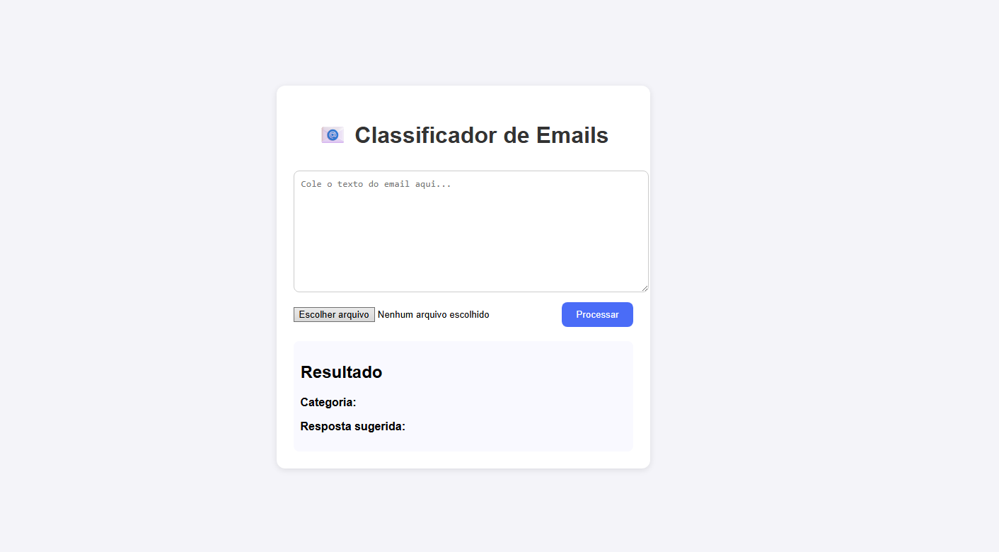

# 📧 Classificador de Emails com IA (Produtivo x Improdutivo + Resposta Automática)

Este projeto é uma aplicação web que:

1. **Lê emails** (texto colado, `.txt` ou `.pdf`);
2. **Classifica** em:
   - `Produtivo` (quando exige ação/resposta)
   - `Improdutivo` (mensagens de cortesia, agradecimentos etc.)
3. **Gera uma resposta automática** em português, usando **OpenAI GPT**.

## 🖼️ Screenshot

> Exemplo de tela da aplicação em uso:



Projeto desenvolvido como solução para um **desafio de processo seletivo** na área de IA / automação de atendimento.

---

## 🧱 Tecnologias utilizadas

- **Backend**
  - [Python 3](https://www.python.org/)
  - [FastAPI](https://fastapi.tiangolo.com/)
  - [Uvicorn](https://www.uvicorn.org/)
  - [scikit-learn](https://scikit-learn.org/) (TF-IDF + Logistic Regression)
  - [NLTK](https://www.nltk.org/) (stopwords em português)
  - [pdfplumber](https://github.com/jsvine/pdfplumber) (extração de texto de PDF)
  - [OpenAI](https://platform.openai.com/) (modelo GPT para gerar respostas)

- **Frontend**
  - HTML, CSS, JavaScript puro (sem framework)
  - Chamada ao backend via `fetch` (API REST)

---

## 📁 Estrutura do projeto

```bash
email-classifier/
├── app/
│   ├── main.py          # API FastAPI (classificação + GPT)
│   └── train_model.py   # Script para treinar e salvar o modelo (model.pkl)
├── web/
│   ├── index.html       # Interface web
│   ├── styles.css       # Estilos básicos
│   └── app.js           # Lógica JS (envio para a API)
├── requirements.txt     # Dependências Python
└── README.md            # Este arquivo


✅ Pré-requisitos

Antes de começar, você precisa ter instalado:

Python 3.9+

pip (gerenciador de pacotes do Python)

(Opcional, mas recomendado) virtualenv / venv

No Linux/Ubuntu, você pode verificar:

python3 --version
pip --version

🔧 1. Clonar o repositório
git clone https://github.com/SEU_USUARIO/email-classifier.git
cd email-classifier


Substitua o link pelo URL real do seu repositório GitHub.

🐍 2. Criar e ativar o ambiente virtual
python3 -m venv venv
source venv/bin/activate        # Linux / macOS

# No Windows (PowerShell):
# venv\Scripts\Activate.ps1


Se o ambiente estiver ativo, seu terminal normalmente mostra (venv) no início da linha.

📦 3. Instalar dependências

Com o venv ativado:

pip install -r requirements.txt

🧠 4. Treinar o modelo de classificação

O modelo (TF-IDF + Logistic Regression) é treinado em um conjunto de exemplos sintéticos para diferenciar emails produtivos x improdutivos.

Rode:

python3 app/train_model.py


Se tudo der certo, você verá algo como:

              precision    recall  f1-score   support
...

✅ Modelo treinado e salvo em app/model.pkl


Isso gera o arquivo:

app/model.pkl


⚠️ Importante: se esse arquivo não existir, o backend vai falhar ao subir. Sempre rode o train_model.py pelo menos uma vez antes de iniciar a API.

🔑 5. Configurar a chave da OpenAI (OPENAI_API_KEY)

Para a geração de respostas com GPT, é necessário ter uma API Key da OpenAI.

Acesse a plataforma da OpenAI (em API keys).

Gere uma nova Secret Key.

No mesmo terminal onde você vai rodar o backend, exporte a variável:

export OPENAI_API_KEY="SUA_CHAVE_AQUI"


Você pode conferir se foi setada:

echo $OPENAI_API_KEY


Se aparecer algo (mesmo truncado), está ok.

No Windows (PowerShell), o equivalente é:

setx OPENAI_API_KEY "SUA_CHAVE_AQUI"

🚀 6. Subir o backend (API FastAPI)

Na raiz do projeto, com o venv ativo e a variável OPENAI_API_KEY configurada:

uvicorn app.main:app --reload


Se tudo estiver correto, você verá algo como:

INFO:     Uvicorn running on http://127.0.0.1:8000 (Press CTRL+C to quit)
INFO:     Application startup complete.


Endpoints principais:

GET / → health check (retorna status ok)

POST /process → recebe email (texto ou arquivo) e retorna:

{
  "categoria": "Produtivo" ou "Improdutivo",
  "resposta": "texto sugerido pelo GPT",
  "texto_extraido": "trecho do email"
}

🌐 7. Subir o frontend (interface web)

Em outro terminal (ou aba nova), sem problema se o venv não estiver ativo, rode:

cd web
python3 -m http.server 5500


Saída esperada:

Serving HTTP on 0.0.0.0 port 5500 ...


Agora, abra o navegador e acesse:

👉 http://127.0.0.1:5500

Você verá a interface:

Campo para colar o texto do email;

Campo de upload de arquivo (.txt ou .pdf);

Botão Processar;

Área de resultado com:

Categoria: Produtivo / Improdutivo

Resposta sugerida: resposta gerada pelo GPT.

🧪 8. Testando a aplicação
Exemplo 1 – Email produtivo

Cole na caixa de texto:

Bom dia, estou com problema para acessar o sistema e preciso de uma atualização sobre a minha solicitação de suporte.


Clique em Processar.

Resultado esperado:

Categoria: Produtivo

Resposta: mensagem formal, com próximos passos, gerada pelo GPT.

Exemplo 2 – Email improdutivo
Olá, passando apenas para desejar um ótimo fim de ano a toda a equipe. Parabéns pelo excelente trabalho!


Clique em Processar.

Resultado esperado:

Categoria: Improdutivo

Resposta: agradecimento cordial, curto, indicando que nenhuma ação é necessária.

📡 9. Como chamar a API diretamente (Postman / cURL)

Se você quiser testar a API sem o frontend:

a) Enviando texto direto (form-data)

URL: http://127.0.0.1:8000/process

Método: POST

Body: form-data

Campo text → conteúdo do email

Exemplo curl:

curl -X POST http://127.0.0.1:8000/process \
  -F "text=Estou com dificuldade para acessar o portal, poderiam verificar?"

b) Enviando arquivo .txt ou .pdf
curl -X POST http://127.0.0.1:8000/process \
  -F "file=@meu_email.pdf"

🧩 10. Possíveis erros comuns (Troubleshooting)
1) RuntimeError: OPENAI_API_KEY não definida

Causa: variável de ambiente não foi configurada.

Solução: no terminal onde vai rodar o uvicorn:

export OPENAI_API_KEY="SUA_CHAVE_AQUI"
uvicorn app.main:app --reload

2) Arquivo de modelo não encontrado em: ... model.pkl

Causa: você ainda não rodou o script de treino.

Solução:

python3 app/train_model.py


Depois disso, tente subir o backend novamente.

3) Frontend abre, mas não aparece resposta

Verifique se o backend está rodando em http://127.0.0.1:8000.

Veja se o terminal do backend mostra logs da requisição:

INFO: 127.0.0.1:XXXXX - "POST /process HTTP/1.1" 200 OK


Se aparecer erro 500, veja o traceback no terminal (geralmente é API key ou modelo).

📌 11. Resumo rápido (para avaliadores)

Para rodar localmente:

git clone https://github.com/SEU_USUARIO/email-classifier.git
cd email-classifier

python3 -m venv venv
source venv/bin/activate
pip install -r requirements.txt

python3 app/train_model.py

export OPENAI_API_KEY="SUA_CHAVE_AQUI"
uvicorn app.main:app --reload


Em outro terminal:

cd email-classifier/web
python3 -m http.server 5500


Acessar:

Backend: http://127.0.0.1:8000

Frontend: http://127.0.0.1:5500